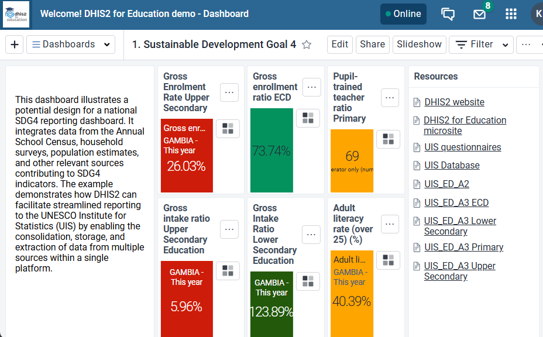

# SDG4 Education Toolkit { #emis-agg-design }

## 1. Introduction

The SDG 4 Education Toolkit provides a standardized digital toolkit for collecting, analysing, and reporting education data required to monitor Sustainable Development Goal 4 (SDG 4): Ensure inclusive and equitable quality education and promote lifelong learning opportunities for all.

The toolkit is implemented using the DHIS2 aggregate data model and provides a harmonized framework for routine education reporting from schools, districts, and national education authorities. It enables countries to collect a core set of education statistics while remaining flexible enough to accommodate national Education Management Information System (EMIS) requirements.

The toolkit combines:

1. Annual School Census (ASC) data.
2. District population data.
3. Education survey datasets.
4. National education expenditure datasets.

Together, these datasets provide the information required to monitor education access, participation, equity, quality, learning environment, teachers, ICT, and financing.

**This is a reference package.** The datasets, data elements, indicators and dashboards it contains are offered as guidance for an implementation, not as a prescriptive standard. Countries are expected to take what fits their national reporting framework, adapt the parts that do not, and extend the package where their policies require more. Nothing in the toolkit assumes that every element will be used, and no part of it is mandatory.

## 2. Background

Education systems require reliable, timely, and comparable data to support planning, budgeting, service delivery, and monitoring of national and global education commitments.

Many countries collect education statistics through annual school census exercises and separate surveys, but these datasets are often fragmented and difficult to analyse together. The SDG 4 Education Toolkit addresses this challenge by providing a unified metadata package that aligns routine education reporting with internationally recognised education indicators.

The toolkit is primarily aligned with:

* Sustainable Development Goal 4 (SDG 4).
* UNESCO Institute for Statistics (UIS) SDG 4 Indicator Framework.
* African Union Continental Education Strategy for Africa (CESA) where applicable.
* National EMIS reporting requirements.

Rather than replacing an existing EMIS, the toolkit provides a minimum harmonised reporting framework that countries can localise and extend according to national education policies and reporting needs.

## 3. Purpose

The purpose of the SDG 4 Education Toolkit is to provide DHIS2 implementers and Ministries of Education with a reusable metadata package that supports routine collection and analysis of SDG 4 education indicators.

The toolkit aims to:

1. Standardize education data collection across administrative levels.
2. Collect the minimum routine education data required for SDG 4 reporting.
3. Harmonize routine education reporting.
4. Improve education planning and resource allocation.
5. Strengthen monitoring of education equity and inclusion.
6. Support reporting to UNESCO Institute for Statistics (UIS), SDG 4, and regional education frameworks such as CESA.

## 4. Toolkit Scope

The toolkit supports data collection across three administrative levels.

| Administrative level | Purpose                                                            |
| -------------------- | ------------------------------------------------------------------ |
| **School**           | Routine annual School Census reporting for education institutions. |
| **District**         | Population denominators and education survey reporting.            |
| **National**         | Education expenditure and financing information.                   |

Tertiary institutions report through the same school-level arrangement, at whichever organisation unit level an implementation uses for post-secondary institutions.

Core design principles

* Harmonized metadata - Common education data elements aligned with international standards.
* Scalable architecture - Supports national, provincial, district, and school reporting structures.
* Configurable implementation - Countries may add or remove metadata according to national policies.
* Analytics - Metadata is designed so indicators and dashboards work immediately after installation.
* SDG Alignment - Data elements are selected because they contribute to SDG 4 monitoring.
* Consistency across levels - The same concept is named, structured and disaggregated the same way at every education level, so that reporting can be compared across the system rather than only within one level.

## 5. System Design Overview

**Reporting Levels**

| Level | Primary Reporting Unit |
|---|---|
| **School** | Schools submit Annual School Census datasets. |
| **District** | District offices submit population and survey datasets and validate school submissions. |
| **National** | Ministry of Education reports national expenditure and analyses national indicators. |

**DHIS2 Configuration Components**

| Metadata Component | Purpose |
|---|---|
| **Datasets** | Annual reporting forms. |
| **Data Elements** | Individual education variables. |
| **Category Combinations** | Age, sex, disability, grade and condition disaggregation. |
| **Sections** | The common structure applied to each reporting form. |
| **Data Entry Forms** | Custom forms used for web data entry. |
| **Indicators** | SDG 4 calculations and derived education measures. |
| **Data Element and Indicator Groups** | Grouping for analysis and for navigating the package. |
| **Dashboards and Visualisations** | Visual monitoring. |
| **User Groups** | Access to metadata, data and dashboards. |

## 6. Toolkit Structure

The toolkit contains seven datasets.

| Dataset | Frequency | Reporting Level |
|---|---|---|
| EMIS Toolkit - ECD Tool | Annual | School |
| EMIS Toolkit - Primary Tool | Annual | School |
| EMIS Toolkit - Lower Secondary Tool | Annual | School |
| EMIS Toolkit - Upper Secondary Tool | Annual | School |
| EMIS Toolkit - Tertiary Tool | Annual | Institution |
| EMIS Toolkit - Household Survey | Annual | District |
| EMIS Toolkit - National expenditure | Annual | National |

**Dataset Relationships**

1. School datasets produce routine education statistics.
2. District datasets provide denominators and contextual indicators.
3. National expenditure supports financing indicators.

### 6.1 A common structure across education levels

The five school and institution datasets are built from one template. The same sections appear in the same order at every level, so a district officer moving between the primary and the lower secondary form encounters the same layout, and an analyst comparing two levels is comparing like with like.

| # | Section | Collects |
|---|---|---|
| 1 | Enrolment | Learners by grade, age and sex; enrolment by nationality |
| 2 | Repeaters | Learners repeating the reporting year |
| 3 | New entrants | New entrants, and those progressing from the previous level |
| 4 | Special needs | Learners by special educational need domain and by degree of difficulty |
| 5 | Absenteeism | Learners absent for more or less than ten per cent of the term |
| 6 | Graduation | Learners graduated from the previous year; average years spent by the finalist cohort |
| 7 | Teachers | Teachers by qualification, certification, training and subject specialism |
| 8 | Facilities | Classrooms, laboratories, library, halls, kitchens, staff accommodation and their condition |
| 9 | WASH and utilities | Drinking water, toilets, handwashing, electricity |
| 10 | ICT | Computers, computers for pedagogical use, internet |
| 11 | Furniture | Desks, shelves, boards |
| 12 | Books and teaching materials | Textbooks and teaching materials by subject |

Two levels vary from the template, for reasons of substance rather than convenience:

* **ECD** has no *New entrants* section — entry into early childhood education is not a progression from a previous level — and adds *Developmentally on track*, which records the health, learning and psychosocial development milestones used for SDG target 4.2.
* **Tertiary** has no *Furniture* section and a reduced *Facilities* section. Institutional infrastructure varies too widely for a shared school-oriented checklist to be meaningful.

The two remaining datasets follow their own structure:

* **Household Survey** — five sections: enrolment in formal and non-formal education, proficiency, educational attainment, ICT skills, and bullying and attacks.
* **National expenditure** — a single section covering total public expenditure, expenditure on education, expenditure on educational services and gross national income.

### 6.2 Population estimates

Several indicators — gross enrolment ratios, out-of-school rates and the proficiency rates — need a population denominator by age group and sex.

The toolkit does **not** include a population dataset. Most target systems already maintain population estimates, whether from a census projection, a national statistics office feed or an existing DHIS2 dataset, and replacing that arrangement would do more harm than good. The toolkit therefore supplies the population data element itself, disaggregated by population age group and sex, and expects the implementation to connect it to whatever population reporting already exists or replace it with the existing data element/s.

### 6.3 The Master School List

The toolkit includes an organisation unit group named **EMIS - Master School List**, which ships empty. It is intended to contain every school in the country at the organisation unit level where the datasets are captured, and it serves as the denominator for the SDG 4.a indicators that express school services as a proportion of all schools. Because its membership is entirely specific to a country's organisation unit hierarchy, it cannot be supplied with the package and must be populated during implementation.

## 7. SDG4 Indicator framework

The toolkit computes indicators across the SDG 4 targets listed below. Indicators are grouped by education level, and separately in an SDG 4 group that gathers the internationally reported measures in one place.

| Target Area | Focus | What the toolkit computes |
|---|---|---|
| **4.1** | Primary and secondary education | Completion rates, out-of-school rates, gross intake ratios, over-age-for-grade by grade, and minimum proficiency in reading, mathematics and science at mid-primary, end of primary and end of lower secondary |
| **4.2** | Early childhood development | Gross enrolment ratio, participation in organised learning one year before primary, and the proportion of children developmentally on track |
| **4.6** | Youth and adult literacy | Minimum proficiency in reading and mathematics for youth aged 15–24 and adults aged 25 and over |
| **4.a** | Education facilities | The proportion of schools offering basic services: drinking water, electricity, handwashing, computers, internet, and infrastructure adapted for learners with disabilities |
| **4.c** | Teachers | The percentage of teachers with the minimum required qualification at each education level, and the pupil-trained-teacher ratio |
| **Finance** | Education financing | Public expenditure on education as a percentage of gross national income and of total government expenditure |

Alongside these, each education level has its own indicator group covering the measures a ministry needs for national planning rather than for international reporting — enrolment and repetition rates, survival and transition, pupil-teacher and pupil-latrine ratios, the share of female teachers, the availability of facilities and furniture, and the special educational needs breakdown.

### 7.1 Extending the indicator set

The toolkit collects more than it currently computes, deliberately. Several SDG 4 targets can be added by an implementation without any change to data collection, because the underlying fields are already in the forms:

* **Target 4.3 — technical, vocational and tertiary education.** The household survey collects participation in formal and non-formal education and training for the 15–24 and 25–65 age groups, and the tertiary dataset collects enrolment, completion and teacher qualification. Participation rate indicators can be configured from these.
* **Target 4.4 — ICT and relevant skills.** The household survey collects the population with ICT skills, disaggregated by skill and sex.
* **Target 4.5 — equity and inclusion.** Every enrolment, completion and proficiency measure is disaggregated by sex, and learners with disability are recorded at all five levels using the Washington Group Short Set. Parity indices between population groups can be derived from the data already collected.
* **Target 4.a — safe learning environments.** The household survey records bullying experienced by students and education personnel, and educational facilities reporting an attack.

These were left as configuration points rather than shipped indicators because the exact definition — which age bands, which comparison groups, which reference population — varies between countries and between reporting frameworks. The data is in place; the calculation is a local decision.

## 8. Disaggregation

Disaggregation is where most of the design effort sits, and it follows a small number of repeating patterns rather than a separate scheme per dataset.

| Family | Applied to |
|---|---|
| **Grade** — a level-specific list, from three levels at ECD to seven at primary | Enrolment, repeaters, new entrants, graduation |
| **Age** — a level-specific band, with an under-age and an over-age category at each end | Enrolment by single year of age, which is what over-age-for-grade and out-of-school rates require |
| **Sex** | Almost everything, so that every headline measure can be reported by sex |
| **Special educational need** — six domains: vision, hearing, mobility, communication, cognition and remembering, and self-care | Learners with special educational needs, at every level |
| **Degree of difficulty** — no difficulty, some difficulty, a lot of difficulty, cannot do at all | The Washington Group Short Set disability measure |
| **Infrastructure condition and status** — good, fair, poor; permanent, temporary | Facilities and furniture |
| **Subject** | Books and teaching materials, and teacher specialism |
| **Nationality** — citizen, non-refugee foreigner, refugee | Enrolment |
| **Proficiency level and population age group** | Household survey and population estimates |

The same six special educational need domains are used at every education level. Earlier versions of the toolkit carried a seventh domain at tertiary only; it was removed so that the disability picture is comparable across the whole education system.

## 9. Data entry forms

Each of the school, institution and survey datasets has a custom data entry form. These reproduce the layout of a familiar paper school census return, with tabbed sections and grids that match how the data is collected in the field, and they are what the DHIS2 web Data Entry app displays.

The custom forms are included **for reference**, as a worked illustration of how a school census return can be laid out in DHIS2. They are written in fixed HTML and are available in English only. An implementation is free to adopt them as they are, adapt them to its own census instrument, or leave them aside and use the section forms.

The sections described in section 6.1 are maintained alongside the custom forms and are not redundant. The DHIS2 Android app and any client that does not render custom HTML use the section form instead, so the two must be kept consistent. National expenditure has no custom form; its single section is the form.

An implementation that adds or removes data elements should expect to update both the section and the custom form.

## 10. Analytics and Dashboard

The SDG4 Education Toolkit includes dashboards that bring together data from the Annual School Census, household surveys, population estimates and other relevant sources to support SDG4 monitoring and reporting.

The dashboards provide:

1. SDG4 indicator monitoring across key education targets.
2. National and subnational analysis by region/district.
3. Disaggregation by sex, education level, grade and institution ownership where available.
4. Trend analysis to monitor changes over time.
5. Equity analysis to identify differences between population groups.
6. Benchmark comparison to assess progress against national targets.
7. Visualisations using charts, maps, scorecards and tables.

Key analytics include:

1. Enrolment and completion rates.
2. Learning proficiency in reading and mathematics.
3. Out-of-school and over-age-for-grade rates.
4. ECD participation and developmental outcomes.
5. Youth and adult literacy and numeracy.
6. Availability of basic school services and infrastructure.
7. Teacher availability and pupil-trained teacher ratios.

The dashboard is organised by SDG 4 target, with a short explanatory panel introducing each target and a set of charts and tables beneath it, and it closes with links to external reference material including the UIS database and questionnaires.

The dashboard is intended to provide decision-makers with a consolidated view of education system performance and support evidence-based planning and SDG4 reporting.

## 11. Languages

The toolkit metadata is currently available in English and French. The custom data entry forms are the exception and are available in English only, as described in section 9.

## 12. Intended Users

| User | Primary Responsibilities |
|---|---|
| **School Administrators** | Capture Annual School Census data. |
| **District Education Officers** | Validate school submissions and analyse district indicators. |
| **Provincial Education Teams** | Monitor regional performance and support planning. |
| **Ministry of Education** | National reporting, dashboards, and SDG monitoring. |
| **Planning Departments** | Budget allocation and resource planning. |
| **Development Partners** | Programme monitoring and reporting. |

User groups

The toolkit ships three user groups. They are supplied empty; assigning users to them is part of implementation.

| User Group | Dashboard and visualisations | Metadata | Data |
|---|---|---|---|
| **EMIS Admin** | View and edit | View and edit | No access |
| **EMIS Access** | View | View | View |
| **EMIS Data Capture** | View | View | Capture and view |

The separation is deliberate: the group that may change the configuration is not the group that may change the data. Note that the dashboard is not publicly visible — a user who belongs to none of these groups will not see it at all, so adding users to a group is one of the first steps after installation.

## 13. Adapting the toolkit

The toolkit is a starting point. Implementations are expected to change it, and the design anticipates the most common changes:

* **Removing what does not apply.** A country that does not collect a particular measure can remove the data element from the dataset and the form. Indicators that depend on it will stop returning values, which is the intended behaviour.
* **Adding national measures.** New data elements, sections and indicators can be added alongside the toolkit's own. Following the same naming and disaggregation patterns keeps the package coherent and makes future upgrades easier to apply.
* **Adjusting grade and age structures.** Grade lists are named generically — Level 1, Level 2 and so on — precisely so that they can carry national grade names without the structure changing.
* **Subject lists.** Books, teaching materials and teacher specialism are structured by subject; the subject list is a configuration point.
* **Localising language.** Names and translations can be replaced with national terminology without affecting how indicators are calculated.

What the toolkit does not include, and does not attempt to provide: an organisation unit hierarchy, population estimates, validation rules, data quality thresholds, or any national target values. These belong to the implementation, not to a reference package.
